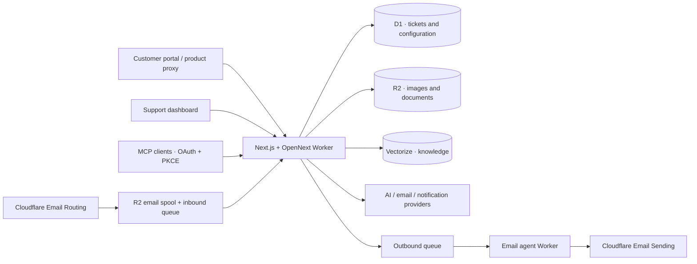

<p align="center">
  
</p>

<p align="center">
  A modern, multi-tenant ticket system for teams that build products.<br />
  Customer portal, support dashboard, email, and AI — on Cloudflare Workers.
</p>

<p align="center">
  <a href="LICENSE"></a>
  <a href="https://github.com/backrunner/onfire/actions/workflows/ci.yml"></a>
  
  
</p>

<p align="center">
  English · <a href="README.zh-CN.md">简体中文</a><br />
  <a href="#local-development">Get started</a> ·
  <a href="docs/DEPLOYMENT.md">Deploy</a> ·
  <a href=".agents/TOC_INTEGRATION.md">Integrate</a> ·
  <a href="CONTRIBUTING.md">Contribute</a>
</p>

## Built around the support workflow

OnFire connects a focused customer portal (**ToC**) to an internal support
dashboard (**ToB**). Manage several products and tenants in one installation,
route requests to the right team, and keep ticket history intact as your forms,
staff, and workflows evolve.

| Capability | What you can do |
| --- | --- |
| Ticket workspace | Search and filter tickets, reply with rich text and inline images, add internal notes, assign, escalate, close, and reopen. |
| Teams and access | Use five scoped roles, separate support-agent membership, tenant/product teams, and read-only lower-role preview. |
| Forms and routing | Build three-level ticket type trees, reuse tenant presets, publish immutable form versions, and inherit team routes. |
| SLA and assignment | Balance pending workloads, set accept/reply deadlines by priority, notify on breaches, and auto-close inactive replied tickets. |
| Customer portal | Integrate with server-issued JWTs or an identity resolver; mount the portal under your product's `/support` path. |
| Languages | English and Chinese UI, product-specific form translations, and AI-assisted ticket/reply translation with preserved originals. |
| Email | Create and reply to tickets through email, preserve threading, edit HTML templates, and review/release quarantined messages. |
| Notifications | Route product events to personal endpoints across 11 channels, with mandatory-channel requirements and delivery logs. |
| AI and knowledge | Use scoped credential pools, ordered provider fallback, ticket prescreening, reply suggestions, an assistant, translation, and semantic knowledge retrieval. |
| Automation | Connect MCP clients through OAuth 2.1/PKCE with granular grants, or use permission-filtered WebMCP tools in supported browsers. |

The dashboard supports light and dark themes, password and Passkey login, optional
TOTP, recovery codes, and trusted devices. APIs enforce both role permissions and
live tenant/product/team scope.

## Architecture



One application Worker serves the two web hostnames. The current source also
includes a separate email transport Worker for selected Cloudflare sender
addresses; it accesses the main application through a restricted service binding.
The main Worker owns D1, inbound processing, and scheduled maintenance.

**Stack:** Next.js 16 · React 19 · TypeScript · Tailwind CSS 4 · shadcn/ui ·
Better Auth · Drizzle · Cloudflare Workers, D1, R2, Queues, and Vectorize.

## Local development

Use **Node.js 22+** and **pnpm 12.3.4** (the version pinned in `package.json`).
The default local workflow uses Wrangler's local D1/R2 storage.

```sh
git clone https://github.com/backrunner/onfire.git
cd onfire
pnpm install --frozen-lockfile
cp .dev.vars.example .dev.vars
cp .env.example .env.local
openssl rand -base64 48
```

Paste the generated value into `AUTH_SECRET` in `.dev.vars`, replacing the
placeholder. The examples use `http://localhost:3001` as the canonical admin
origin and leave Turnstile disabled locally.

```sh
pnpm db:migrate:local
pnpm db:seed
pnpm db:seed:tickets
pnpm dev:tob
```

Wait for the dashboard server to be ready, then run `pnpm dev:toc` in a second
terminal. Starting the two local Workers simultaneously on first boot can race
on SQLite initialization. `pnpm dev` is also available to start both together;
if it reports `SQLITE_BUSY`, stop both and start them in the order above.

- **Dashboard:** <http://localhost:3001/admin/login> — local demo login
  `admin@local.onfire` / `admin`.
- **Portal:** <http://localhost:3000> — customer access requires a product identity.
  Use the [portal integration guide](.agents/TOC_INTEGRATION.md) to issue a customer
  JWT or configure an identity resolver. The seeded product ID is `product-local`.
- **Empty installation:** skip the two seed commands and open
  <http://localhost:3001/admin/install> to create your own administrator.

`pnpm db:reset` is a convenience command that **deletes local D1 data**, migrates,
and seeds demo content. Demo credentials must never be used in production.
The dev commands run Next.js development servers; they do not exercise Worker cron,
queue consumers, or the email agent. Vectorize has no local emulator. AI and
external delivery need separately configured services.

## Deploy on Cloudflare

Follow [the deployment guide](docs/DEPLOYMENT.md) to provision resources, configure
the two hostnames, apply migrations, and deploy the application and email Worker.
The checked-in Wrangler files contain **example values**, not a ready-to-use
production account. Keep build-time domains and runtime domains in sync.

This is a Cloudflare deployment: D1, R2, Queues, and other enabled services have
their own plans and costs. A generic Node.js server or Docker deployment is not
currently supplied.

## Integrations

| Area | Supported integrations |
| --- | --- |
| Language models | OpenAI (Responses or Chat), OpenRouter, Anthropic, Google, xAI, DeepSeek |
| Embeddings | OpenAI, OpenRouter, Qwen/DashScope, Jina AI, Cohere, Google |
| Reranking | Cohere, Jina AI |
| Inbound email | Cloudflare Email Routing, generic authenticated webhook, Maileroo, Resend, Stalwart DATA-stage MTA Hook |
| Outbound email | Resend, SendGrid, Mailgun, Maileroo, SMTP, Cloudflare Email Sending |
| Spam filtering | Local rules, Postmark SpamCheck, Akismet, OOPSpam, Stop Forum Spam, custom HTTPS classifier, optional AI |
| Notifications | Email, PushDeer, Bark, ntfy, Telegram, Discord, Slack, Microsoft Teams, Feishu, DingTalk, WeCom |

Provider credentials are configured in the dashboard. Multi-language products
require an enabled translation route; knowledge entry writes require embeddings.
Embedding dimensions must match the bound Vectorize index.

## Documentation and status

- [Deployment and configuration](docs/DEPLOYMENT.md)
- [Customer portal, reverse proxy, and identity](.agents/TOC_INTEGRATION.md)
- [MCP and OAuth delegation](.agents/MCP_INTEGRATION.md)
- [Dashboard WebMCP](.agents/WEBMCP_INTEGRATION.md)
- [Stalwart inbound mail](.agents/STALWART_INTEGRATION.md)
- [Embedding model and index migration](.agents/EMBEDDING_MIGRATION.md)
- [Architecture and permissions](AGENTS.md) · [Development status](.agents/STATUS.md)
- [Open-source readiness review](docs/OPEN_SOURCE_READINESS.md)

OnFire is under active development. PDF/DOC/DOCX uploads are stored, but document
text extraction and chunk embedding are not implemented; structured knowledge
entries support embedding and retrieval. WebMCP depends on browser support.
The repository does not currently ship the `@onfire/sdk` package described in
some historical planning material; integrations should use the documented HTTP
APIs. Check the readiness review for the exact revision and validation scope.

## Contributing and license

See [CONTRIBUTING.md](CONTRIBUTING.md) for setup and checks, and
[SECURITY.md](SECURITY.md) for private vulnerability reporting.

OnFire is licensed under [Apache License 2.0](LICENSE).
Copyright 2026 BackRunner and the OnFire contributors.
Third-party components retain their own licenses; see
[THIRD_PARTY_NOTICES.md](THIRD_PARTY_NOTICES.md).
