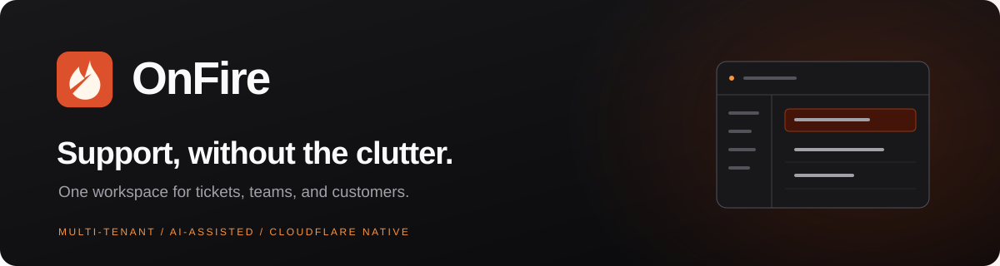

<p align="center">
  
</p>

<p align="center">
  为产品团队打造的多租户工单系统。<br />
  将客户门户、客服工作台、邮件和 AI 集成在 Cloudflare Workers 上。
</p>

<p align="center">
  <a href="LICENSE"></a>
  <a href="https://github.com/backrunner/onfire/actions/workflows/ci.yml"></a>
  
  
</p>

<p align="center">
  <a href="README.md">English</a> · 简体中文<br />
  <a href="#本地开发">快速开始</a> ·
  <a href="docs/DEPLOYMENT.md">部署指南</a> ·
  <a href=".agents/TOC_INTEGRATION.md">产品接入</a> ·
  <a href="CONTRIBUTING.md">参与贡献</a>
</p>

## 围绕工单处理设计

OnFire 将简洁的客户门户（ToC）与内部客服工作台（ToB）连接起来。
一套系统管理多个租户与产品，将请求分配给合适的团队，并在表单、人员和流程
变化后保留完整的历史记录。

| 能力 | 功能 |
| --- | --- |
| 工单工作台 | 搜索与筛选、富文本及行内图片回复、内部备注、分配、升级、关闭和重新打开。 |
| 团队与权限 | 五级角色与资源范围校验，独立的客服成员身份，租户/产品团队，以及低权限身份的只读预览。 |
| 表单与路由 | 最多三级的工单类型树、租户预设、不可变表单版本，以及向父级继承的团队路由。 |
| SLA 与分配 | 按待处理数量均衡分配，按优先级配置受理/回复期限，超时提醒及已回复工单自动关闭。 |
| 客户门户 | 通过服务端签发 JWT 或身份解析服务接入，也可反向代理到产品的 `/support` 路径。 |
| 多语言 | 中英文界面、产品级表单翻译、保留原文的工单与回复 AI 翻译。 |
| 邮件工单 | 邮件建单与回复、线程关联、HTML 模板编辑，以及垃圾邮件隔离、审查和释放。 |
| 通知 | 11 种个人接收渠道，产品级投递规则、必需渠道要求和投递日志。 |
| AI 与知识库 | 分层凭据池、按顺序故障切换、工单预审、回复建议、助手、翻译与语义检索。 |
| 自动化 | 支持 OAuth 2.1/PKCE 和细粒度授权的 MCP；支持浏览器内按权限注册的 WebMCP 工具。 |

工作台支持明暗主题、密码与 Passkey 登录、可选 TOTP、恢复码和受信任设备。
API 同时校验角色权限及实时的租户、产品、团队范围。

## 架构

一个 Next.js + OpenNext 应用 Worker 服务管理端和客户端两个域名，使用
D1 保存业务数据，R2 保存图片和文档，Vectorize 支持知识检索。
当前源码还包含独立邮件 Worker：入站邮件先写入 R2 和队列，由主应用处理；
指定 Cloudflare 发件地址的出站邮件通过队列交给邮件 Worker 发送。
邮件 Worker 通过受限服务绑定访问主应用，主应用负责 D1 与定时维护。

[查看架构图](README.md#architecture)。技术栈包括 Next.js 16、React 19、
TypeScript、Tailwind CSS 4、shadcn/ui、Better Auth、Drizzle 和 Cloudflare 服务。

## 本地开发

需要 **Node.js 22+** 与 **pnpm 12.3.4**（版本固定在 `package.json` 中）。
默认开发流程使用 Wrangler 提供的本地 D1/R2 存储。

```sh
git clone https://github.com/backrunner/onfire.git
cd onfire
pnpm install --frozen-lockfile
cp .dev.vars.example .dev.vars
cp .env.example .env.local
openssl rand -base64 48
```

将生成的随机值填入 `.dev.vars` 的 `AUTH_SECRET`，替换占位值。
示例使用 `http://localhost:3001` 作为管理端规范地址，本地默认关闭 Turnstile。

```sh
pnpm db:migrate:local
pnpm db:seed
pnpm db:seed:tickets
pnpm dev:tob
```

等待管理端服务就绪，再在另一个终端运行 `pnpm dev:toc`。两个本地 Worker 首次
同时启动可能竞争 SQLite 初始化。也可以用 `pnpm dev` 同时启动；如果出现
`SQLITE_BUSY`，停止两个服务后按上述顺序启动。

- **管理端：** <http://localhost:3001/admin/login>，本地演示账号为
  `admin@local.onfire` / `admin`。
- **客户端：** <http://localhost:3000>。客户访问需要产品身份，请按
  [接入指南](.agents/TOC_INTEGRATION.md) 签发客户 JWT 或配置身份解析服务。
  演示产品 ID 为 `product-local`。
- **空白安装：** 跳过两个 seed 命令，访问
  <http://localhost:3001/admin/install> 创建自己的管理员。

`pnpm db:reset` 会**删除本地 D1 数据**，重新迁移并填充演示内容；演示账号不能
用于生产环境。开发命令启动 Next.js 开发服务器，不运行 Worker 定时任务、
队列消费者或邮件 Worker。Vectorize 没有本地模拟器，AI 和外部消息投递需要
另外配置服务。

## 部署到 Cloudflare

[部署指南](docs/DEPLOYMENT.md) 包含资源创建、双域名、数据库迁移、密钥以及
应用和邮件 Worker 的部署步骤。仓库中的 Wrangler 文件使用**示例值**，需要
替换为自己的域名与资源标识；构建时和运行时的域名配置必须一致。

当前部署依赖 Cloudflare，D1、R2、Queues 等服务按各自套餐计费。仓库尚未提供
通用 Node.js 服务器或 Docker 部署方案。

## 支持的集成

| 类型 | 服务 |
| --- | --- |
| 语言模型 | OpenAI（Responses / Chat）、OpenRouter、Anthropic、Google、xAI、DeepSeek |
| Embedding | OpenAI、OpenRouter、Qwen/DashScope、Jina AI、Cohere、Google |
| Rerank | Cohere、Jina AI |
| 收件 | Cloudflare Email Routing、通用认证 Webhook、Maileroo、Resend、Stalwart DATA 阶段 MTA Hook |
| 发件 | Resend、SendGrid、Mailgun、Maileroo、SMTP、Cloudflare Email Sending |
| 垃圾邮件过滤 | 本地规则、Postmark SpamCheck、Akismet、OOPSpam、Stop Forum Spam、自定义 HTTPS 分类器、可选 AI |
| 通知 | 邮件、PushDeer、Bark、ntfy、Telegram、Discord、Slack、Microsoft Teams、飞书、钉钉、企业微信 |

服务商凭据在工作台配置。开启多语言产品需要有效的翻译路由；写入知识条目
需要 Embedding 配置，其维度必须匹配绑定的 Vectorize 索引。

## 文档与当前限制

- [部署和配置](docs/DEPLOYMENT.md)
- [客户门户、反向代理与身份接入](.agents/TOC_INTEGRATION.md)
- [MCP 与 OAuth 授权](.agents/MCP_INTEGRATION.md)
- [工作台 WebMCP](.agents/WEBMCP_INTEGRATION.md)
- [Stalwart 邮件接入](.agents/STALWART_INTEGRATION.md)
- [Embedding 模型与索引迁移](.agents/EMBEDDING_MIGRATION.md)
- [架构与权限](AGENTS.md) · [开发状态](.agents/STATUS.md)
- [开源准备检查报告](docs/OPEN_SOURCE_READINESS.md)

项目仍在持续开发。PDF/DOC/DOCX 当前可上传保存，但尚未实现正文提取和分块
向量化；结构化知识条目已支持向量化与检索。WebMCP 依赖浏览器支持。部分历史
规划中提及的 `@onfire/sdk` 尚未包含在仓库内，请使用文档中的 HTTP API 接入。
具体检查版本和验证范围见开源准备报告。

## 贡献与协议

欢迎提交问题和改进，详见 [CONTRIBUTING.md](CONTRIBUTING.md)。安全问题请按
[SECURITY.md](SECURITY.md) 私下报告。

OnFire 使用 [Apache License 2.0](LICENSE)。
Copyright 2026 BackRunner and the OnFire contributors。
第三方组件保留其原有许可证，详见 [THIRD_PARTY_NOTICES.md](THIRD_PARTY_NOTICES.md)。
